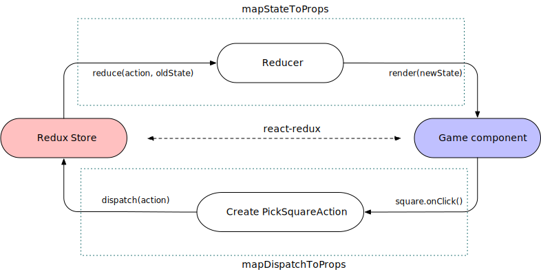

:toc-title: Jump to topic 
:toc:
:docinfo1:
:last-update-label!:

= Chess Game Tutorial (Part 2)

== Overview

In part 1, we have discussed how to develop a chess game app with React and JSX in N4JS. There, we have stored the application state in the React component Game's state. As applications become larger, however, the mix of application state and UI makes the application hard to comprehend and more difficult to test.

As a result, in large applications, link:https://redux.js.org/[Redux] - an implementation of link:https://facebook.github.io/flux/[Flux architecture] also created by Facebook - is often used to organize the application code. Redux strictly allows the data to flow in only one direction as shown in the following diagram. Also, Redux is UI agnostic and can be used in conjunction with any UI library. In this tutorial, we will extract the entire game state out of React components and store it in a Redux store.

== Source code

The source code of the chess application can be found at link:https://github.com/Eclipse/n4js-tutorials/tree/master/chess-react-redux[`n4js-tutorials/chess-react-redux^`].

== Redux Architecture with React

In this section, we will review several key concepts of Redux when used with React. You should consult official Redux documentation for more details. When using React with Redux, we normally store the application state in Redux store instead of React components' state. As a result, React components become stateless UI elements and they simply render the UI using the data retrieved from the Redux store. In a Redux architecture, data flows strictly in one direction. The following diagram graphically depicts the action/data flow in a React + Redux app.

image::images/redux-architecture.svg[Redux architecture, width='70%', align="center"]

The action/data flow in the diagram can be roughly understood as follows:

* When a user interaction is triggered on the React component (e.g. button clicked, text field edited etc.), an action is created. The action describes the changes needed to be updated in the application state. For instance, when a text field is edited, the action created may contain the new string of the text field.
* Then the action is dispatched to the Redux store whereby the Redux store stores the application state, usually as a hierarchical tree of state.
* The reducers take the action and the current application state and create an updated application state.
* If the changes in the application state are to a certain React component, they are forwarded into the component in form of props. The change in props causes the component to re-render.

== Connect React to Redux

In a React + Redux app, we have stateless React components rendering UI elements on the one side. On the other side, we have a Redux store that stores our application state. We need to establish a connection between them.

In particular, when the user interaction is triggered on a React component, we need to turn this user interaction into actions that are then processed by reducers to create a new application state in the Redux store. Conversely, when the application state in the Redux store is changed, we need to inform the React components that are interested in the change so that they can re-render.
Fortunately, the npm library react-redux can establish exactly this connection for us.

== Store Chess Game State in Redux Store

Recall that in the previous implementation, the game state is stored as _state_ in the React component Game. We move state out of Game component and store it in a Redux instead. In this section, we will provide some hints on the implementation. The reader should study the source code for the detailed implementation.

In Game component, we define two mapping functions needed by `react-redux` to connect Game component with the Redux store.

[source,typescript]
----
/**
 * Map Redux state to Game's props
 */
function mapStateToProps(state: StoreState): GameProps {
  return {
      history: state.history,
      stepNumber: state.stepNumber,
      whiteIsNext: state.whiteIsNext,
      pickedSquare: state.pickedSquare,
      validDestinations: state.validDestinations
  }
}

/**
 * Map Game's events to Redux actions
 */
function mapDispatchToProps(dispatch: {function(ReduxAction): any} ) {
  return {
    createPickSquareAction: (pos: Coordinate) => {
      dispatch(createPickSquareAction(pos))
    },
    jumpToStep: (step: number) => {
      dispatch(createJumpToStepAction(step))
    }
  }
 }

export public const ConnectedGame = connect(mapStateToProps, mapDispatchToProps)(Game);
----

Whenever a square is clicked, an instance of `PickSquareAction` is created. A redux action has be a subclass of `ReduxAction`. Note that, react-redux requires that every action has a `type`. In N4JS, we can use the fully qualified name of the class for this purpose. Hence, we define a base class `ActionBase` for all actions.

[source,typescript]
----
/**
 * Base Redux action. Its type is the FQN of the class
 */
export public class ~ActionBase implements ReduxAction {
   @Override
     public type: string = this.constructor.n4type.fqn;
}
----

The `PickSquareAction` class and function creating an instance of that class are very simple
[source, typescript]
----
/**
 * Pick square action
 */
export public class PickSquareAction extends ActionBase {
  /**
   * The coordinate of the picked square
   */
  public coord: Coordinate;

  public constructor(@Spec spec:~i~this) {}
}

/**
 * Create a PickSquareAction
 */
export public function createPickSquareAction(pos: Coordinate): PickSquareAction {
  return new PickSquareAction({ coord: pos });
}
----

A reducer modifies the state in the Redux store based on an action. For the purpose of this application, we define a single reducer that is interested in all actions. An implementation of the reducer chooses the actions it is interested and returns a new state from the old one based on the action.

[source,typescript]
----
/**
 * For this demo application, this reducer is interested in all actions.
 */
export public function reducer(state: StoreState, action: ReduxAction): StoreState {
  if (!state) {
    state = initialState;
  }
  const { history, stepNumber, whiteIsNext } = state;

  switch (action.type) {
    case PickSquareAction.n4type.fqn: // This reducer is interested in this action
     ...

    case JumpToStepAction.n4type.fqn: // This reducer is interested in this action
      ...

    default:
      // Irrelevant action, return the old state
      return state;
  }
}

----

When the reducer returns a new state, that state is passed through the function `mapStateToProps` which selects the props that are relevant to Game component. The Game component then re-renders with the updated props.

== Test Game Rules with Mangelhaft

Since the focus of the tutorials is on N4JS, we have not discussed test yet. In a real world project, however, it is extremely important to have tests, especially unit tests, to assure the correctness of the application. The good news is, unit tests for N4JS applications can be written very conveniently in our xUnit-based test framework Mangelhaft that provides assertion methods resembling JUnit's familiar to Java developers.

For instance, we will write a Mangelhaft test that tests the implementation of the reducer. In particular, we test that given the initial arrangement of the chess board, if an action `PickSquareAction` is created for the coordinate `(0,1)` (i.e. the left white knight is picked), the valid destinations are updated correctly in the new state. One possible way of expressing this test in Mangelhaft is as follows:

[source,typescript]
----
export public class ReducePickSquareActionTest {

  private state: StoreState;

  @Before
  public init() {
    this.state = initialState;

  }

  @Test
  public knightValidDestinationsTest() {
    const pickSquare = new Coordinate({row: 0, col: 1});
    const pickLeftWhiteKnight = createPickSquareAction(pickSquare);
    const newState = reducer(this.state, pickLeftWhiteKnight);
    Assert.equal(newState.validDestinations.length, 2, 'Must have 2 valid destinations');
    for (const validDest of newState.validDestinations) {
      Assert.equal(validDest.row - pickSquare.row, 2, 'Wrong row');
      Assert.equal(Math.abs(validDest.col - pickSquare.col), 1, 'Wrong column');
    }
  }
  ...
}
----

Note that the way we are testing the game logics is completely UI-agnostic and no React components are involved at all! This is thanks to the decoupling of game logics from UI with the help of Redux.

// Include Prism for syntax highlighting
+++
<link rel="stylesheet" type="text/css" href="https://cdnjs.cloudflare.com/ajax/libs/prism/1.15.0/themes/prism.min.css"></link>
    
    
+++

== Run the test

You can execute the test cases either on the command line or in the N4JS Eclipse IDE.
On the command line, run the tests by the defined npm script:

[source,bash]
----
npm run test
----

To run the tests in the IDE, open the test file and right-click somewhere in its editor.
In the context menu select "Run as" -> "Test in Node.js".
