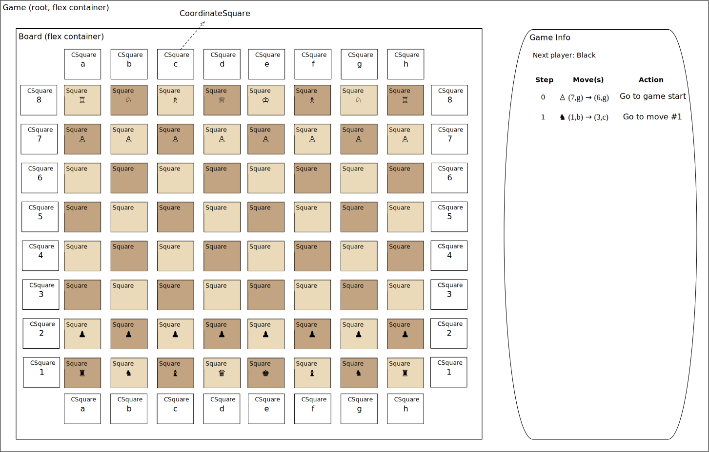
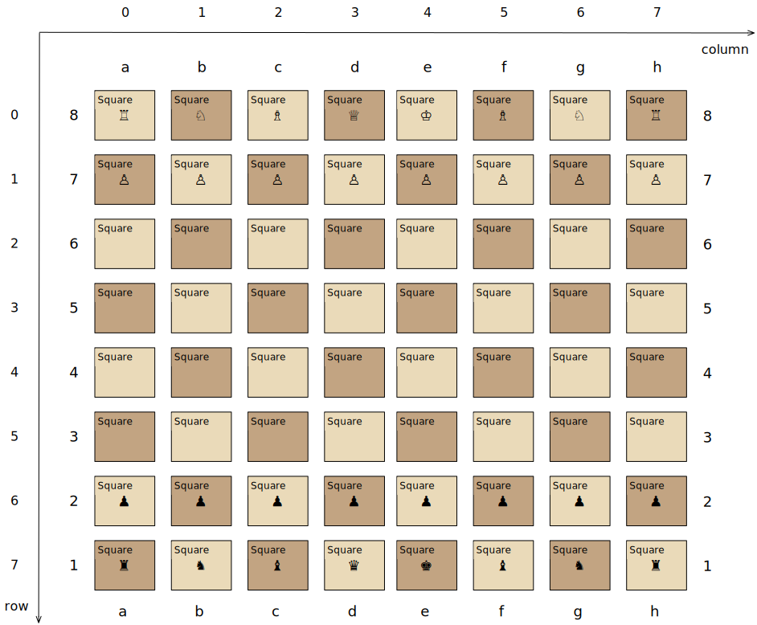
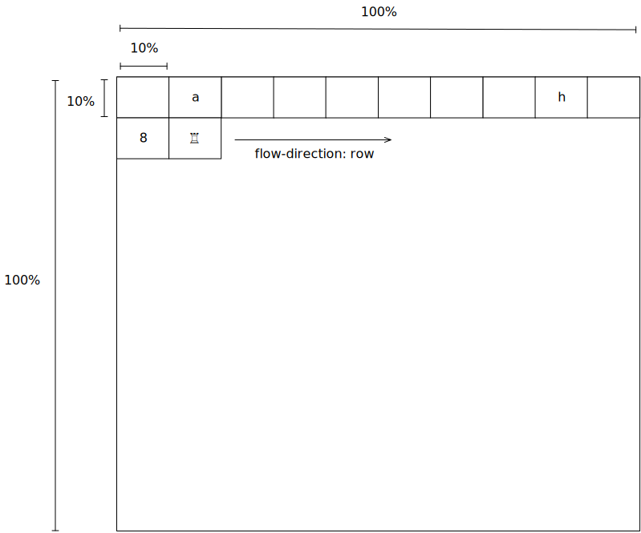
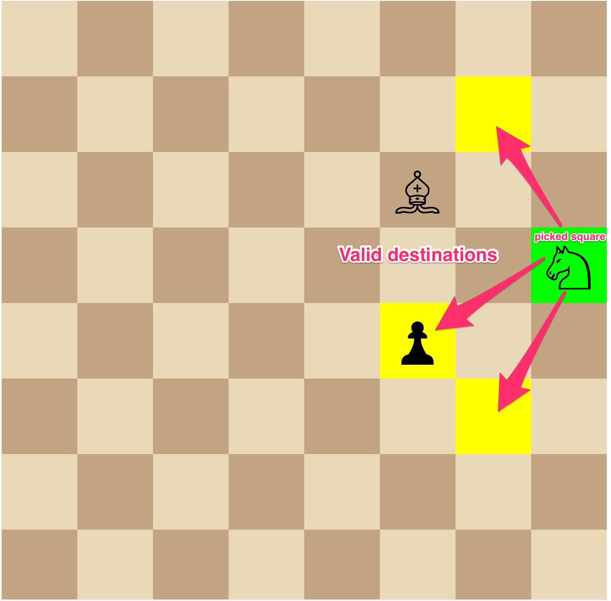
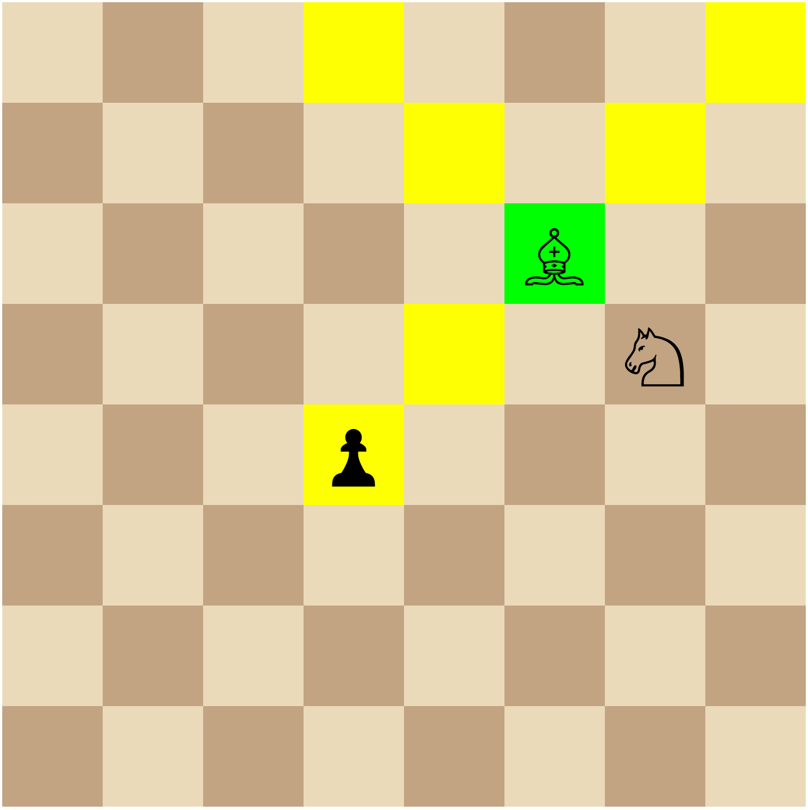
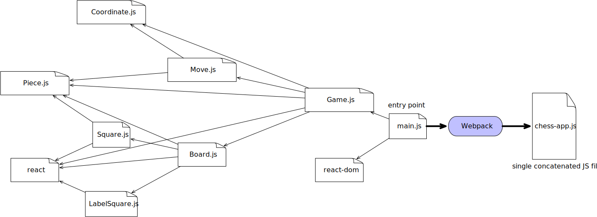

== Overview

link:https://reactjs.org/[React^] is a popular JavaScript library created by Facebook widely used for developing web user interface. N4JS provides full support for React as well as the JavaScript extension link:https://reactjs.org/docs/introducing-jsx.html[JSX^] for describing UI elements. Internally, we have been using N4JS in combination with React and JSX for years to develop very large e-commerce web applications.
In this tutorial, we will develop a simple and yet fun (!) chess game with N4JS and React. For the purpose of this tutorial, the chess game only allows two humans to play against each other.

Before starting with the implementation, let's explicitly state several features we would like to have in our application.

* When the chess application is started, a chess board of 8x8 squares shall be showed containing 16 white pieces and 16 black pieces in their initial positions.
* A player in turn shall be able to use the mouse to pick one of the pieces that she/he wants to move. A picked piece shall be clearly recognizable. Moreover, to aid players, especially beginners, whenever a piece is picked, all possible valid destination squares shall be visually highlighted as well.
* In addition to the game board, there shall be a game information area that shows which player is in turn. Moreover, the game information area shall show a complete history of the game protocolling each move made by the players. As a bonus, jumping back to a previous state of the history shall be possible.

The final game will look approximately like this. You may want to challenge your co-worker to a game  now!

+++
<iframe src="chess.html" width="100%" height="620" frameBorder="0"></iframe>
+++

== Repository

The source code of the chess application can be found at link:https://github.com/Eclipse/n4js-tutorials/tree/master/chess-react[n4js-tutorials/chess-react^].

include::../../chess-react/README.adoc[leveloffset=0,tag=DevSetup]

include::../../chess-react/README.adoc[leveloffset=0,tag=CreateApp]

== N4JS type definitions of React

In order to enable N4JS's type checking for React, we need to declare `@n4jsd/react` as a dev dependency in `package.json` of the project. `@n4jsd/react` consists of `n4jsd` files that contain file definitions for React.

[source,json]
----
{
    "name": "n4js-tutorial-chess",
    "devDependencies": {
    	"@n4jsd/react": "<=16.6.*",
    },
    "dependencies": {
        "react": "^16.6.0",
    }
}
----

The concept of `n4jsd` files in N4JS is very similar to TypeScript's `d.ts` definition files in that they both do not contain any implementations and are only used for type checking. In addition to React, the link:https://github.com/NumberFour/n4jsd[n4jd repository^] has `n4jsd` projects for many popular JavaScript library such as `lodash` or `express` etc.

== File extension n4jsx

The standard file extension of N4JS is `.n4js`. N4JS files containing React and JSX must have the extension `.n4jsx`.
Also, every `.n4jsx` has to have import `React` explicitly.

== Graphical representation of chess board and pieces

At this point, we probably ask the question: _How should we draw the chess board?_
We could use link:https://developer.mozilla.org/en-US/docs/Web/API/Canvas_API[Canvas API]. To keep the application simple, however, in this tutorial, we draw the chess board with pure CSS using link:https://developer.mozilla.org/en-US/docs/Learn/CSS/CSS_layout/Flexbox[flexbox model^]. In particular, the chess board can be defined as a flex container with `flex-wrap: wrap` whereas the squares are flex items.

_How about chess pieces?_
Instead of images, we use link:https://en.wikipedia.org/wiki/Chess_symbols_in_Unicode[Chess symbols in Unicode^] to display chess pieces.
There are many ways to represent pieces in N4JS, the simplest way being to declare a link:https://www.eclipse.org/n4js/spec/N4JSSpec.html#_string-based-enums[String-based enum^] called `Piece` to represent pieces. The enum literals are the Unicode chess symbols.

[source,typescript]
----
@StringBased
export public enum Piece {
    WHITE_PAWN : '♙',
    WHITE_ROOK : '♖',
    WHITE_KNIGHT : '♘',
    WHITE_BISHOP : '♗',
    WHITE_QUEEN : '♕',
    WHITE_KING: '♔',

    BLACK_PAWN : '♟',
    BLACK_ROOK : '♜',
    BLACK_KNIGHT : '♞',
    BLACK_BISHOP : '♝',
    BLACK_QUEEN : '♛',
    BLACK_KING: '♚'
}
----

The advantage of String-based enums is that in N4JS code, we can use the enum literals, e.g. Piece.WHITE_PAWN etc., to refer to the pieces in the exact the same way as with normal enums. That means, we receive full validation support from N4JS compiler and IDE as with normal enums. In the transpiled JavaScript code, these enum literals are replaced by the corresponding chess symbols (strings).

== React components tree

As typical with React applications, we need to decide how the UI of our chess game should be structured as a tree of React components. In this example, we have opted for the following structure.

The root React component is `Game` that consists of two areas. The left area is the React component `Board` showing the chess board while the right area shows the game information.

== Square React component

In the tree of React components in this application, `Square` is one of the leaf React components. It defines a single square of the chess board that can be clicked by the current user. Its value is either a `Piece` representing a piece or `null` if the square is empty. In this example, we define Square as a lightweight functional component since it does not have any state.

[source,typescript]
----

/**
 * Square props
 */
export public interface ~SquareProps extends React.ComponentProps {
    public isWhite: boolean;
    public piece: Piece;
    public onClick: {function(): void}
    public isPicked: boolean;
    public isValidDestination: boolean;
}

/**
 * Board square styles
 */
const boardSquareStyles = {
    display: 'flex',
    justifyContent: 'center',
    alignItems: 'center',
    width: '100%',
    height: '100%',
    fontSize: '5vw'
}

/**
 * Square React component
 */
export public function Square(props: SquareProps): React.Element<?> {
    let backgroundColor: string = props.isWhite? '#EADAB9' : '#C2A482';
    // Special square highlighting a picked square or valid destination?
    if (props.isPicked) {
      backgroundColor = 'lime';
    } else if (props.isValidDestination) {
      backgroundColor = 'yellow';
    }

    return (
        

            {props.piece}
      

    );
}

----

The functional definition of `Square`, in fact of any React component, must have a single `props` parameter of a subtype of `React.ComponentProps` and return an instance of type `React.Element<?>`. In this example, `SquareProps` dictates that when a `Square` is instantiated, it expects the following _mandatory_ `props`:

* `isWhite`: `true` if the square is a white square and `false` otherwise.
* `piece`: the piece on the square, of type `Piece`. This is necessary because the states of the squares are managed by a parent React component.
* `isPicked`: `true` if the square contains a piece that has been picked by the current player with the intention to move it to a new position and `false` otherwise. This is necessary to change the background of the square to highlight that the square has been picked.
*  `isValidDestination`: `true` if the square should be highlighted as a valid destination for a picked square and `false` otherwise.
* `onClick`: the event handler to be called when the square is clicked. `Square` component uses this event handler to inform the parent `Board` component of the clicking event.

In addition to having explicit types, the props can be declared as mandatory (as in this example) or _optional_ with the help of the question mark. For instance,  if we would declare `public piece?: string`, it would mean that `piece` would be an optional property when creating `Square`.

Here we start to see the advantages of an N4JS implementation over a pure non-typed JavaScript implementation. First, since the props required by `Square` are made explicit, the code is more readable. Second, when a `Square` component is created, the compiler will enforce the types of the props. Third, the N4JS compiler will complain if a mandatory prop is missing. And all these validations happen _at compile time_ during development. In pure JavaScript, we would recognize type mismatch or missing mandatory props problem much later _at runtime_, possibly during production.

The `render` method of the `Square` component returns an JSX expression, particularly a `
` whose content is the piece to be displayed. The CSS style is dynamically calculated to set the background color based on the values of the passed props.

== Board React component

The `Board` React component represents the chess board. Even though it does not have state, we define it as a class because it contains helper methods. The most important _prop_ needed by this React component is `squares` that is an 8x8 array of `Piece` containing an arrangement of pieces on the board. To avoid tiring mental calculation, we use the browser's coordinate system, i.e. the top left square has the coordinate `(0,0)` while the bottom right's coordinate is `(7,7)`. Note that the coordinates of the 8x8 `Pieace` array is different from that of link:https://en.wikipedia.org/wiki/Algebraic_notation_(chess)[algebraic chess notation^].

In addition to 8x8 black/white squares, we should also display the conventional board's coordinates because these coordinates are used for displaying the game history.

_How can we create such a board with pure CSS?_ The probably easiest way is to use link:https://css-tricks.com/snippets/css/a-guide-to-flexbox/[flexbox model^].
In particular, the board is defined as a _flex container_ with `flex-wrap: wrap`.
The squares displaying chess pieces and coordinates in algebraic chess notation are _flex items_. Together with squares displaying coordinates (called _coordinate squares_ in this implementation), there are 10 x 10 squares inside the `Board` component in total. As a result, each square occupies 10% width and 10% height of the board's width and height. The following diagram graphically depicts this.

Since we have to deal a lot with coordinates, we define the `Coordinate` data structure to represent (row,column) coordinates.

[source,typescript]
----
export public class Coordinate {
    public row: number;
    public col: number;

    /**
     * Spec constructor
     *
    public constructor(@Spec spec:~i~this) {}

    /**
     * Compare two coordinates
     */
    public equals(other: Coordinate): boolean {
        return (this.row == other.row) && (this.col == other.col);
    }

    /**
     * Convert the this to board's coordinate
     */
    public getBoardCoordinateRepresentation() {
        const rowLabel = 8 - this.row;
        const colLabel =  String.fromCharCode('a'.charCodeAt(0) + this.col);
        return `(${rowLabel + ',' + colLabel})`;
    }

    @Override
    public toString(): string {
        return `(${this.row},${this.col})`;
    }
}
----

In the class `Coordinate` above, we define a link:https://www.eclipse.org/n4js/spec/N4JSSpec.html#spec-constructor[Spec constructor^]. This Spec constructor allows us to instantiate a Coordinate by supplying all public members in an object literal. For example,

[source,typescript]
----
let c: Coordinate = new Coordinate({ row: 1, col: 2});
----

Equally interesting is the method `toString` which should be very familiar to Java developers. This method defines the string representation of a Coordinate.

The data structure `BoardProps` defining the props of `Board` component is:

[source,typescript]
----
/**
 * Board props
 */
export public interface ~BoardProps extends React.ComponentProps {
    public squares: Array<Array<Piece>>;
    public pickedSquare: Coordinate;
    public validDestinations: Array<Coordinate>;
    public onClick: {function(Coordinate): void}
}
----

In addition to `squares`, additional props are:

* `pickedSquare`: the (row, column) coordinate indicating the currently picked square if exists and `null` otherwise.
* `validDestinations`: if `pickedSquare` exists, this array contains the coordinates of the valid destinations of the piece on the picked square.
* `onClick`: the event handler to be called when the square at a certain position is clicked. `Square` component informs `Board` component which in turn informs a parent component about a clicking event.

The following screenshot graphically depicts a chess board in which the square `(3,7)` containing a white knight is picked by the player. The picked square is visually recognizable via the green color. Additionally, all valid destinations of the white knight are highlighted in yellow color.

The class `Board`, as any class representing a React component, must extend `React.Component` and override the `render()` method.

[source,typescript]
----
/**
 * Board React component
 */
export public class Board extends React.Component<BoardProps, Object> {
   /**
  * Render the i-th square on the board 0 <= i <= 63
  */
  private renderSquare(pos: Coordinate, isWhite: boolean, isPicked: boolean, isValidDestination: boolean, piece: Piece): React.Element<?> {
      return (
        

            <Square
                isWhite={isWhite}
                isPicked={isPicked}
                isValidDestination={isValidDestination}
                piece={piece}
                onClick={() => this.props.onClick(pos)}
              />
          

      );
  }

   /**
  * Render coordinate square
  */
  private renderCoordinateSquare(label: string): React.Element<?> {
      return (
        

            <CoordinateSquare
              label={label}
            />
        

      );
    }

  private renderSquares(): Array<React.Element<?>> {
    const squares = new Array<React.Element<?>>();
    let isWhiteInitial = true;
      // Draw row coordinates: a b c ... h
      squares.push(this.renderCoordinateSquare(''));
      for (let i = 0; i < 8; i++) {
        squares.push(this.renderCoordinateSquare(String.fromCharCode('a'.charCodeAt(0) + i)));
      }
      squares.push(this.renderCoordinateSquare(''));

    for (let row = 0; row < 8; row++) {
        // Draw column coordinate: 8 7 6 ... 1
        squares.push(this.renderCoordinateSquare((8-row).toString()));
      let isWhite = isWhiteInitial;
      for (let col = 0; col < 8; col++) {
          const pos = new Coordinate({row: row, col: col});
          const isPotentialDestination: boolean =
              this.props.validDestinations.findIndex(potentialDest => potentialDest.equals(pos)) >= 0;
        squares.push(this.renderSquare(pos, isWhite,
            this.props.pickedSquare && this.props.pickedSquare.equals(pos)? true : false,  isPotentialDestination, this.props.squares[pos.row][pos.col]
        ));
        isWhite = !isWhite;
      }
      isWhiteInitial = !isWhiteInitial;
      squares.push(this.renderCoordinateSquare((8-row).toString()));
     }
    // Draw row coordinates: a b c ... h
    squares.push(this.renderCoordinateSquare(''));
      for (let i = 0; i < 8; i++) {
          squares.push(this.renderCoordinateSquare(String.fromCharCode('a'.charCodeAt(0) + i)));
      }
      squares.push(this.renderCoordinateSquare(''));

    return squares;
  }

  @Override
  public render(): React.Element<?> {
    return (
      

        { this.renderSquares() }
      

    );
  }
}
----

Note that `React.Component` expects two type arguments: the first type argument is the type of props and the second type argument is the type of state. Here, in the `render` method we create 8x8 `Squares` components that make up the chess board. We also create two rows and two columns of `CoordinateSquare` displaying the chess board coordinates.

== Game React component (root)

This is the root React component of this application and hence does not have any props. Instead, it has a state represented by `GameState`. The game state consists of the history of the board as an array of `Snapshot`, among others.

[source,typescript]
----
/**
 * A history snapshot
 */
interface ~Snapshot {
    public squares: Array<Array<Piece>>;
    public lastMoves: Array<Move>;

    public whiteKingMoved: boolean;
    public leftWhiteRookMoved: boolean;
    public rightWhiteRookMoved: boolean;

    public blackKingMoved: boolean;
    public leftBlackRookMoved: boolean;
    public rightBlackRookMoved: boolean;
}

/**
 * Game state
 */
interface ~GameState {
    public history: Array<Snapshot>;
    public stepNumber: int;
    public whiteIsNext: boolean;
    public pickedSquare: Coordinate;
    public validDestinations: Array<Coordinate>;
}
----

A snapshot of the history contains:

* `squares`: a 2-dimensional array containing an arrangement of pieces on the chess board.
*  `lastMoves`: contains the last moves leading to the arrangement of pieces. The reason why this is an array, instead of a single element, is that a link:https://en.wikipedia.org/wiki/Castling[castling^] move changes the positions of a king and a rook at the same time.

Further flags such as `whiteKingMoved` etc. remember if kings or rooks have been moved already. These kinds of information are relevant for handling castling.

You may ask what the tilde symbol means, for instance in `~Snapshot`? The tilde symbol here indicates that _structural subtyping_  should be used during type checking. In essence, it means that when checking whether some object or instance is a subtype of `~Snapshot`, the type system only cares if that object or instance has all the public fields declared in `~Snapshot`. And if yes, the object is considered a subtype of `Snapshot`. This is exactly the behavior what we want here. You should read link:https://www.eclipse.org/n4js/features/nominal-and-structural-typing.html[structural typing vs. nominal subtyping^] for further explanation.

`GameState` stores the entire state of the application and consists of:

* `history`: array of snapshots capturing the entire history leading up to the current arrangement of the chess board.
* `stepNumber`: the current step number. Its initial value is `0`. Each time when a player places a move, it is increased by `1`.
* `whiteIsNext`: `true` if the white player is in turn and `false` otherwise.
* `pickedSquare`: the (row,column) coordinate indicating the currently picked square if exists and `null` otherwise.
* `validDestinations`: if `pickedSquare` exists, this array contains the coordinates of the squares being the valid destinations of the piece on the picked square.

Here, again thanks to type checking, the N4JS compiler will complain if we, for instance, access a non-existing field of `GameState` or use the wrong type of a certain field of `GameState` _at compile time_. In pure JavaScript, we would recognize those mistakes only at runtime.

The `Game` component is quite complex because it implements the game rules. In the next section, we will look at some of the implementations of the game rules.

== Implementation of game rules

The `Game` component contains logics for implementing the game rules. In this section, we will discuss logics for

* Calculating the set of squares being attacked by a certain piece.
* Calculating the set of squares being valid destinations (squares) of a certain piece.
* Checking checkmate.

We can see that the set of squares being attacked by a certain piece and the set of squares being valid destinations of a certain piece are closely related. For rooks, knights, bishops, queens, these two sets are in fact almost identical with the exception that moving one of these pieces cannot cause the king to be in check. However, pawns are quite special because they
 can attack diagonal squares but can only move forwards vertically. Kings have special castling moves that jump two squares.

As an example, we will have a look at the algorithm for calculating squares attacked by a bishop. The general movement rule for a bishop looks as follows:

* A bishop can move diagonally but the destination must lie within the border of the chess board.
* A bishop cannot jump over other pieces on its movement.
* If there is an opponent piece on its movement, a bishop can capture it.
* A bishop (as any other piece) cannot move if its movement would cause the king (of the same color) to be in check

The following screenshot shows an example highlighting valid destinations for the white bishop.

There are certainly tons of ways to calculate the set of squares/destinations attacked by a bishop in particular, and by a piece in general. In this tutorial, we have opted for a simple imperative implementation: starting from the current position, we iterate 4 different directions: north west, north east, south east, south west. In each direction, we keep moving forwards as far as possible. The implementation is as follows:

[source,typescript]
----
private calculateDestinationsAttackedByBishop(squares: Array<Array<Piece>>,
                                              figure: Piece, pos: Coordinate): Array<Coordinate> {
    const row = pos.row;
    const col = pos.col;
    const result: Array<Coordinate> = new Array<Coordinate>();

    // NORTH WEST, NORTH EAST, SOUTH EAST, SOUTH WEST
    const deltas = [[-1,-1], [-1,1], [1,1], [1,-1]];
    // Iterate 4 directions
    for (let delta of deltas) {
        let newPos = new Coordinate({row: row + delta[0], col: col + delta[1]});
        while (this.isInsideBoard(newPos)) {
            if (!squares[newPos.row][newPos.col]) {
                // Square is not occupied
                result.push(newPos);
            } else {
                // Square is occupied
                if (this.isPositionOccupiedByFigureSameColor(squares, figure, newPos)) {
                    break;
                }
                if (this.isPositionOccupiedByFigureOtherColor(squares, figure, newPos)) {
                    result.push(newPos);
                    break;
                }
            }
            newPos = new Coordinate({row: newPos.row + delta[0], col: newPos.col + delta[1]});
        }
    }
    return result;
}
----

The set of all valid destinations of a bishop is the set of all squares attacked by the bishop with the condition that moving it does not cause the king to be in check. The method `isKingInCheckIfMove` in the `Game` component _simulates_ a move of a piece and checks if the move would cause the king of the same color to be in check.

[source,typescript]
----
/**
 * Check whether the king is in check if the move is made
*/
private isKingInCheckIfMove(attemptedMove: Move) {
    // Check if the move causes the king to be in check
    const {squares: changedSquares} = this.move(attemptedMove);
    const isWhite = this.isWhitepiece(attemptedMove.piece);
    const kingPos = this.getKingPosition(changedSquares, isWhite);
    if (!kingPos) {
        return false;
    }
    return this.isKingInCheck(changedSquares, isWhite? Piece.WHITE_KING : Piece.BLACK_KING, kingPos)
}
----

Checking whether a king is checkmated is interesting. A king is checkmated if all pieces cannot move anymore, i.e. have no valid destinations. This logics is implemented by the method `calculateWinner` in `Game.n4jsx`.

[source,typescript]
----
/**
 * Calculate the winner
 */
private calculateWinner(squares: Array<Array<Piece>>): string {
    const isWhite = this.state.whiteIsNext;
    const allPieces = this.getAllPiecesSameColor(squares, isWhite);
    // Checkmate if all pieces have no valid destinations
    const checkMate =
    this.forAll(allPieces,
      (p) => this.calculateValidDestinations(squares, p.piece, p.pos).length == 0
    );
    if (checkMate) {
      return isWhite? 'Black': 'White';
    } else {
      return null;
    }
}
----

== Build with Webpack

We use Webpack to bundle all JavaScript files of the application, including dependencies such as React, into a single JavaScript file. Webpack is configured in `webpack.config.js`. The following diagram graphically depicts the build process with the help of Webpack.

The entry file used by Webpack to calculate the dependency graph is `src-gen/main.js` which depends on `react-dom` and  `src-gen/Game.js` which depends on ... etc. The bundled JavaScript is stored in `public/dist/chess-app.js` which is then included in `index.html`.

The content of `webpack.config.js` is as follows:

[source,javascript]
----
const path = require('path');
const HtmlWebpackPlugin = require('html-webpack-plugin');
const CleanWebpackPlugin = require('clean-webpack-plugin');
const webpack = require('webpack');

module.exports = {
  mode: 'development',

  entry: {
    // Webpack starts calculating dependency graph from this file
    app: './src-gen/main.js'
  },
  output: {
    // The output concatenated file
    filename: 'chess-app.js',
    publicPath: 'dist/',
    path: path.resolve(__dirname, 'public/dist')
  },

  devtool: 'inline-source-map',

  /** Configure Webpack Dev server */
  devServer: {
    // Serve files from the `public` folder at localhost:8080
    contentBase: path.join(__dirname, 'public'),
    port: 8080,
    hot: true,
    inline: true
  },

  plugins: [
    new CleanWebpackPlugin(),
    new webpack.HotModuleReplacementPlugin()
  ],

  resolve: {
      alias: {
      "n4js-tutorial-chess": __dirname
    }
  }
};
----

Note that we need to specify the entry point `./src-gen/main.js` instead of `./src/main.n4js` of course because Webpack and web browser only understand the generated JavaScript files. The concatenated JavaScript file is `public/dist/chess-app.js` which contains the entire chess application. We also configure a Webpack Dev server with hot loading enabled so that we can start the application locally.

// Include Prism for syntax highlighting
+++
<link rel="stylesheet" type="text/css" href="https://cdnjs.cloudflare.com/ajax/libs/prism/1.15.0/themes/prism.min.css"></link>
    
    
+++

