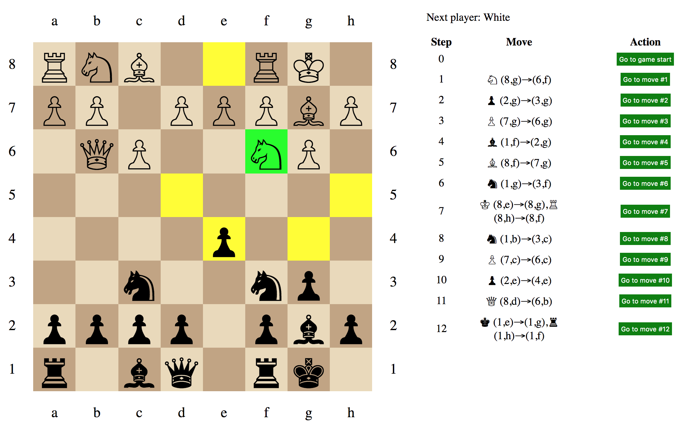

This project demonstrates how to develop a chess game application using link:https://www.eclipse.org/n4js/[N4JS] and link:https://reactjs.org/[React].
The tutorial is hosted in the tutorial section of the link:https://www.eclipse.org/n4js/userguides/index.html#_tutorials[N4JS webpage].
The game looks like this:

// The tag DevSetup is used in n4js-tutorial-chess.adoc.
// tag::DevSetup[]
== Developer Setup and generate folder `src-gen`

There are two alternatives for the developer setup and the generation of the `src-gen` folder:
to use either the N4JS Eclipse IDE or use the command line only.

=== Use command line only

Open the project folder in a shell and execute the following commands:

[source,bash]
----
npm install      # download node_modules
npm run build    # generate js files in folder src-gen
----

=== Use N4JS Eclipse IDE

Step 1::
Download the latest N4JS IDE from the link:https://www.eclipse.org/n4js/downloads.html[N4JS Download Page] for your operating system.

Step 2::
The project is already an Eclipse project with the `.project` file in the root `chess-react` folder.
Hence, you can simply import it into the N4JS IDE workspace via `File => Import => Existing Projects into Workspace`.
The IDE may complain that npm dependencies declared in `package.json` are missing.
Use the quickfix `run npm/yarn in this project` to fix this issue.

Step 3::
In the N4JS IDE, open the library manager (N4JS IDE => Preferences... => N4JS => N4JS External Libraries) and click on the button `Re-Build node_modules`.

Step 4::
Clean & Build the project. After this step, the project has no compilation errors anymore.
+
Now, the folder `src-gen` should have been created and populated with `.js` files of the project.
The `.js` files will be used in the next step by webpack.
// end::DevSetup[] 

// The tag CreateApp is used in n4js-tutorial-chess.adoc.
// tag::CreateApp[]
== Create the application

The `package.json` defines a script `webpack` to create the application `chess-app.js`.
Run it with:

[source,bash]
----
npm run webpack
----

== Start local web server

The `package.json` defines a script `start` for starting the Webpack Dev Server serving the application to a browser on `http://localhost:8080`.
To start the web server, run:

[source,bash]
----
npm start
----
// end::CreateApp[]

